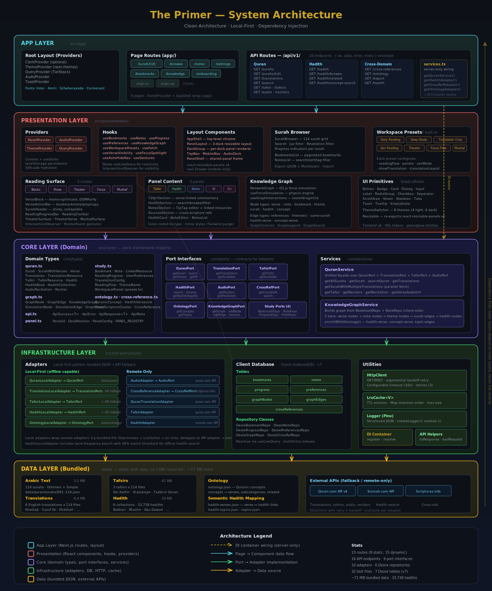

# The Primer

> A deeply personal, infinitely patient, contextually aware companion that meets you where you are and goes as deep as you want to go.


**Live:** [quran-primer.vercel.app](https://quran-primer.vercel.app)

---

## Why

A place where you can peacefully read the Quran and never lose context — no matter how deep you dive. Every verse is a doorway into translations, commentary, hadith, cross-scripture references, and your own evolving understanding. The app remembers everything, connects everything, and meets you exactly where you left off.

This is not a reading app. This is a **personal knowledge system** built around the Quran.

**The luxury of time and peace.** No gamification, no streaks, no rush. Just depth. You have all the time in the world to study, understand, ask questions, go back.

The Quran belongs to everyone. A study tool for the Quran should not be locked behind proprietary walls — the core experience is open source, the data is always local, and your notes are always yours.

> The name comes from Neal Stephenson's *The Diamond Age* — a book that teaches by meeting you where you are, adapting to your curiosity, and growing with you.

---

## What

### Reading

- **5 reading modes**: Blocks (default verse-by-verse), Prose (flowing text), Theater (full-screen cinematic), Focus Flow (scroll spotlight), and Mushaf (open-book spread with page turns)
- **6 English translations** you can toggle individually: The Clear Quran (Khattab), Yusuf Ali, Pickthall, Hilali & Khan, Abdel Haleem, Tafhim-ul-Quran (Maududi)
- **Arabic text** with Uthmani script, adjustable font size, per-translation font and bold settings
- **7 workspace presets**: Daily Reading, Deep Study, Translation Comparison, Zen Reading, Theater, Focus Flow, Mushaf
- **8 themes** (4 light, 4 dark): The Library, Amethyst, Sahara, Garden, The Observatory, Cosmos, Midnight, Matrix

From any verse, open layers of understanding — tafsir, hadith, cross-references, your own notes — all in context, without ever leaving the page. Go three levels deep into a commentary chain and one tap collapses everything back to the exact verse you started from. **The breadcrumb trail never breaks. The reading position never moves.**

### Study

- **3 tafsirs** (commentaries): Ibn Kathir, Al-Jalalayn, Tazkirul Quran — all bundled locally, verse-linked navigation
- **33,738 hadith** across 6 major collections (Bukhari, Muslim, Abu Dawud, Tirmidhi, Nasa'i, Ibn Majah) — search, browse by book, filter by grade (Sahih/Hasan/Da'if)
- **Cross-scripture references** via Scripturas.info
- **Quranic ontology** showing concept relationships per surah

### Personal Knowledge

- **Rich note editor** (TipTap) with titles, tags, verse/surah references, and color-coded note types (reflection, question, connection, hadith, tafsir)
- **Link hadith and tafsir** directly to notes via "Save to Notes" buttons
- **Pin, sort, search, export** (JSON + Markdown), and import notes
- **Knowledge mind map** — D3.js force-directed graph visualizing connections between your notes, verses, and concepts

### Navigation & Layout

- **Multi-dock resizable panels** — left, right, and bottom docks with tafsir, hadith, notes, AI, and sources panels
- **Surah browser** with search, juz/revelation filters, and reading progress
- **Audio playback** with verse-by-verse highlighting
- **Bookmarks** with tag organization
- **Onboarding** flow to configure translations, tafsirs, hadith collections, and theme on first visit
- **PWA support** — installable on mobile/desktop

---

## How It Works

### Architecture

Clean Architecture with dependency injection — no framework coupling in the domain layer:

```text
src/
├── core/              # Domain types, port interfaces, services (zero React imports)
│   ├── types/         # Surah, Verse, Hadith, Note, Bookmark, etc.
│   ├── ports/         # Contracts: QuranPort, HadithPort, TafsirPort, etc.
│   └── services/      # QuranService, KnowledgeGraphService
├── infrastructure/    # External world implementations
│   ├── adapters/      # Local-first adapters with API fallback
│   ├── db/            # Dexie (IndexedDB) for client-side persistence
│   ├── http/          # HttpClient with retry + circuit breaker
│   ├── cache/         # LRU cache with TTL
│   └── logging/       # Pino structured logging
├── presentation/      # React layer
│   ├── components/    # UI components (layout, reading, study, notes, etc.)
│   ├── hooks/         # Custom hooks (useBookmarks, useNotes, usePreferences, etc.)
│   └── providers/     # Context providers (Panel, Audio, Query, Theme)
├── lib/               # DI container, API helpers, utilities
└── app/               # Next.js App Router routes + 16 API routes
```



### Data Strategy: Local-First

All core data ships bundled with the app — **no internet required for reading**:

| Data | Files | Size |
| ---- | ----- | ---- |
| Arabic text (Uthmani) | 114 surahs | 3.5 MB |
| Translations | 6 translations x 114 files | 6.4 MB |
| Tafsirs | 3 tafsirs x 114 files | 41 MB |
| Hadith | 6 collections (33,738 hadith) | 20 MB |

Local adapters read from `data/` at build time. API adapters fall back to quran.com's v4 API when local data is unavailable. User data (notes, bookmarks, settings, progress) lives in the browser via IndexedDB (Dexie).

### Tech Stack

| Layer | Technology |
| ----- | ---------- |
| Framework | Next.js 16 (App Router), React 19 |
| Language | TypeScript (strict, noUncheckedIndexedAccess) |
| Styling | Tailwind CSS v4 with HSL design tokens |
| State | React Query (server), React Context + Dexie hooks (client) |
| Editor | TipTap (rich text notes) |
| Graphs | D3.js (force-directed knowledge map) |
| Database | Dexie (IndexedDB) — local-first, no server DB required |
| Testing | Vitest + React Testing Library + happy-dom |
| Logging | Pino (structured, JSON) |
| Deployment | Vercel |

### API

16 versioned routes under `/api/v1/` with a consistent envelope (`{ ok, data, error, meta }`):

- `/surahs`, `/surahs/[id]` — surah metadata and verses
- `/translations` — translation text by surah
- `/tafsir`, `/tafsirs` — commentary text and available tafsirs
- `/hadith`, `/hadith/browse`, `/hadith/related`, `/hadith/concept-search` — hadith search, browse, and discovery
- `/search` — full-text Quran search
- `/audio`, `/reciters` — audio streaming and reciter list
- `/cross-references` — cross-scripture links
- `/ontology` — Quranic concept relationships
- `/export` — data backup endpoint
- `/health` — service health check

---

## Getting Started

### Prerequisites

- Node.js 18+
- npm

### Setup

```bash
# Clone the repository
git clone https://github.com/sadiash/quran-primer.git
cd quran-primer

# Install dependencies
npm install

# Copy environment variables
cp .env.example .env.local
```

### Development

```bash
npm run dev -- -p 5555
```

Open [http://localhost:5555](http://localhost:5555).

### Scripts

| Command | Description |
| ------- | ----------- |
| `npm run dev` | Start dev server (Turbopack) |
| `npm run build` | Production build (Webpack) |
| `npm run lint` | ESLint |
| `npm run type-check` | TypeScript strict check |
| `npm test` | Run all tests (Vitest) |
| `npm run test:watch` | Watch mode |
| `npm run test:coverage` | Coverage report |
| `npm run format` | Prettier format |

---

## Testing

32 test files covering API routes, core services, infrastructure, and utilities:

```bash
npm test              # Run all tests
npm run test:watch    # Watch mode
npm run test:coverage # With coverage
```

Tests use Vitest with happy-dom, fake-indexeddb for Dexie tests, and explicit `vi` imports from `"vitest"`.

---

## Deployment

The app deploys to Vercel with zero configuration:

1. Connect your GitHub repo to Vercel
2. Deploy — pushes to `main` trigger auto-deployment

---

## Project Structure

```text
quran-primer/
├── data/                    # Bundled Islamic text data (JSON)
│   ├── quran/surahs/        # 114 Arabic text files
│   ├── translations/        # 6 translations x 114 files
│   ├── tafsirs/             # 3 tafsirs x 114 files
│   └── hadith/              # 6 collections (33,738 hadith)
├── docs/                    # Design docs, research, UX briefs
│   ├── CONCEPT.md           # Vision and philosophy
│   ├── PLAN.md              # Implementation roadmap
│   └── diagrams/            # Architecture SVGs
├── public/                  # Static assets, fonts, icons
├── src/
│   ├── app/                 # Next.js routes (23 total)
│   │   ├── (app)/           # Authenticated app routes
│   │   ├── api/v1/          # 16 API routes
│   │   └── onboarding/      # First-time setup
│   ├── core/                # Domain layer
│   ├── infrastructure/      # Adapters, DB, HTTP, logging
│   ├── presentation/        # React components + hooks
│   └── lib/                 # DI, utilities, helpers
├── V2_NEXT_STEPS.md         # Tech debt and improvement roadmap
└── PLAN.md                  # Original implementation plan
```

---

## Next Steps (V2)

Documented in detail in [V2_NEXT_STEPS.md](V2_NEXT_STEPS.md):

- **Architecture**: Break up 14 large files (300+ lines each) into focused components and hooks
- **Input Validation**: Add Zod schemas to all 12 API routes (currently manual string checks)
- **Rate Limiting**: Add tiered rate limiting (strict for auth, standard for search, relaxed for reads)
- **Test Coverage**: Expand from 32 test files (14% file coverage) toward 40%+, starting with 4 untested API routes
- **Observability**: Request ID tracing, structured error logging (some catch blocks swallow silently)
- **Per-User Data**: Scope IndexedDB by Clerk user ID, or migrate to server database for cross-device sync

---

## Contributing

This project is open source under AGPL-3.0. Contributions are welcome.

1. Fork the repository
2. Create a feature branch (`git checkout -b feature/your-feature`)
3. Make your changes
4. Run `npm run type-check && npm run lint && npm test` to verify
5. Submit a pull request

---

## License

[AGPL-3.0](LICENSE) — free to use, modify, and distribute. If you deploy a modified version as a network service, you must share your source code.

---

## Acknowledgments

- Quran text and translations via [Quran.com API v4](https://api-docs.quran.com/)
- Hadith data via [Hadith API](https://github.com/fawazahmed0/hadith-api) and HuggingFace datasets
- Cross-scripture references via [Scripturas.info](https://scripturas.info/)
- The name inspired by Neal Stephenson's *The Diamond Age*
